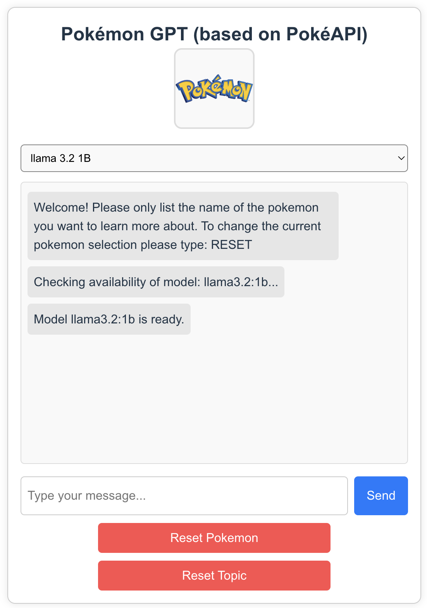
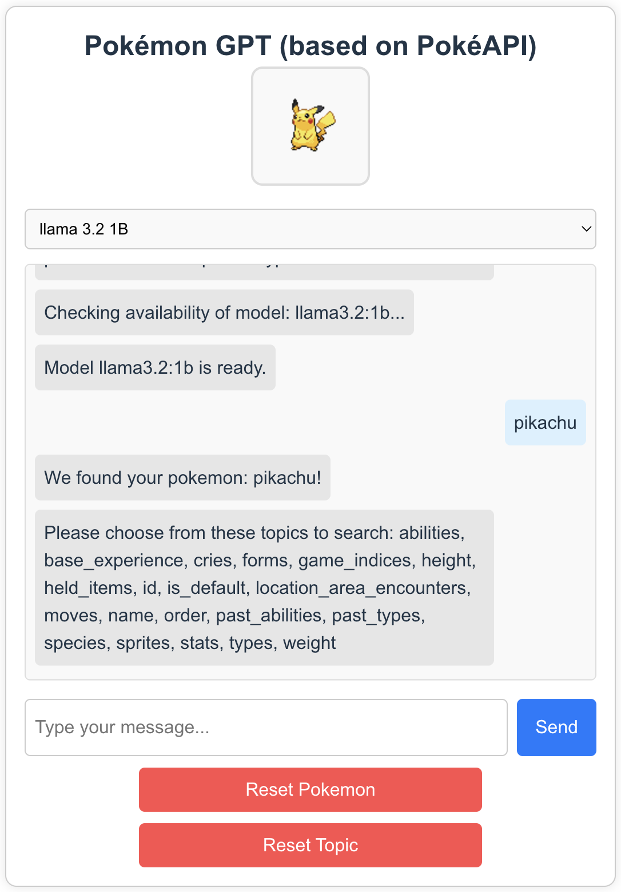
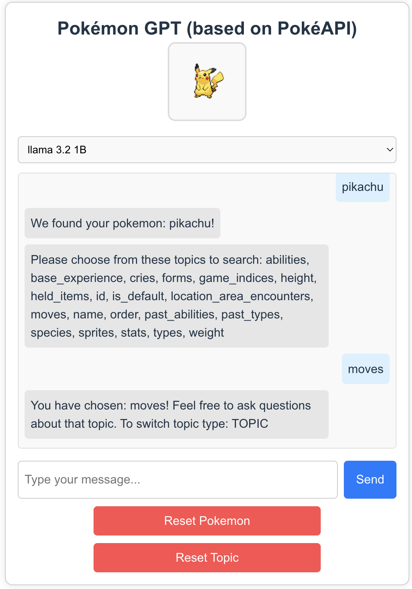
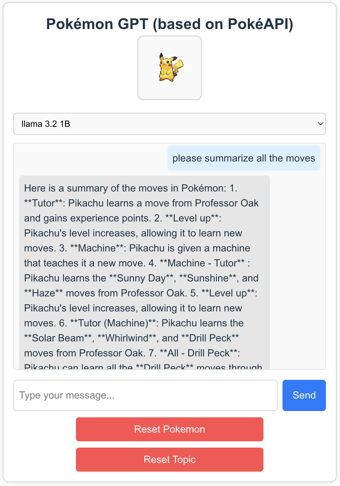
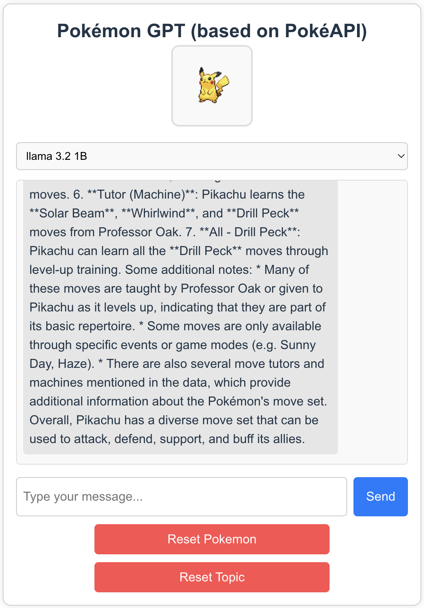

# Set Up
**clone repository:** `git clone `  
**install dependencies:** `npm install`  
**cd into directory:** `cd holocron` `cd client`  
**start local server:** `node src/index.js`  
**run webapp locally:** `npm run dev`

# Usage

### llama 3.2 1B 

### Starting Screen

### Selecting Pokemon

### Selecting Topic

### Searching over a Topic

# Overview
I created a chatbot "Pokemon GPT" to interact with information from the PokéAPI data.
I don't know much about pokemon so I thought it would be nice to pair the power of an LLM to interpret the API data.

This project is built using Vite, React, and Express. Vite provides a fast development server and optimized builds, React offers a component-based architecture for building user interfaces, and Express handles the backend server and API routes.

You can pick from 4 different LLMs:
- mistral 7B
- llama 3.1 8B
- llama 3.2 1B
- llama 3.2 3B

The mistral 7B and llama 3.1 8B models are slower than the llama 3.2 1B + 3B models, however they are more descriptive. These models are served via an Ollama framework for web applications. There are other models available (a lot more) but testing them all would have not been feasible so I opted to use lightweight known models. For example a 70B model most computers could not run. 

The hardware I used to run this demo is a mac mini with these specs:
- CPU: Apple M4 Pro
- Memory: 24 GB
- GPU: 12 cores

There was a lot of work around prompt engineering as these models were prone to hallucinating.

The design is meant to be sleek and lightweight. The photo will render an image above the model selector of whatever pokemon you are currently asking questions about. I did not want to incorporate too many UI components as it is a chatbot.

# Improvements

It would be best to run the model in a containerized environment with more compute on a server. Although it works for demo purposes locally it is not ideal since the latency will vary from user to user based on their hardware.

Ollama is stateless meaning that queries are disjoint and it does not store chat history. Ideally we would want to store the chat histories with some summarization technique to save on tokens and therefore it could have states.

More time for testing would be good as well, I tried to test as extensively as I could myself but having others test the application would be best in additon to my own testing.

